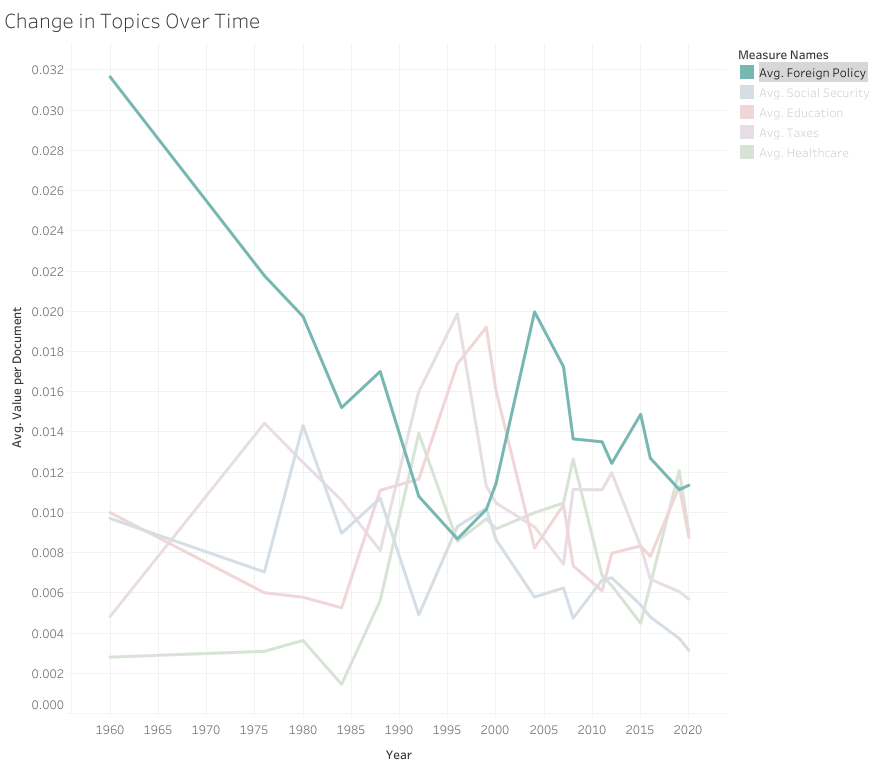
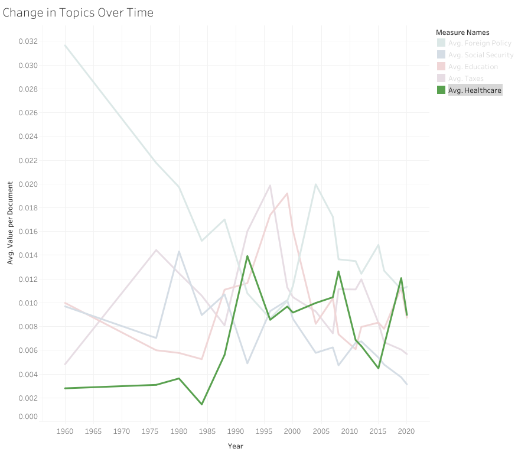

# Presidential Debate Analysis :horse: :us: :elephant:
## Analyzing Presidential Debates Using Natural Language Processing
## *Metis Project 4*
## By: Patrick Bovard

### Project Introduction:
**Project Description:** 
The goal of this project is to use Natural Language Processing (NLP) techniques to better understand how presidential debates in the United States have evolved over time.  Going into the project, the major questions I wanted to explored were:  
1. How have debates changed over time?
2. Do parties or moderators tend to focus on certain topics?  Have these changed over time?
3. Do party nomination winners and losers have specific focuses compared to each other?

**Data Sources:** Data has been scraped using BeautifulSoup from the following sites for this project:  
- [Commission for Presidential Debates:](https://www.debates.org/voter-education/debate-transcripts/) Transcripts cover the General Election Debates, 1960-present  
-  [The American President Project from UC Santa Barbara:](https://www.presidency.ucsb.edu/documents/presidential-documents-archive-guidebook/presidential-campaigns-debates-and-endorsements-0) Transcripts cover all general elections and for primary debates for Republican and Democrat candidates, 2000-present  

**Data Organization:**
For analysis, each "row" of data contained the following information:
- Debate Name, Date, and Year
- Speaker Name, Type (Republican, Democrat, Moderator/Other), and Election Result of the Speaker
- Data Source
- Debate Type (General-President, General-VP, Primary-Republican, Primary-Democrat)
- Text from one paragraph of the debate transcript (i.e. roughly one speaking line)

**Tools Used:**  
- Webscraping: BeautifulSoup
- Data Analysis and Model Building: Python, Pandas, Numpy, Scikit-Learn
- Natural Language Processing: TF-IDF Vectorization, Topic Modeling via NMF, Count Vectorization, Lemmatization, NLTK, VADER Sentiment Analysis  
- Visualizations: Matplotlib, Tableau

**Possible Impacts:**  Possible impacts of this project cover a few different areas:  
- Research and Understanding: the changes in topics/focuses and sentiment over time can provide a deeper understanding into the issues facing the USA at any given election, as well as what candidates found may help their campaigns.  For example, understanding what focuses winning candidates had can illuminate what led them to greater success than their opponents.
- Predictive modeling: using topics and/or sentiments as features, the results of this project could be utilized in a predictive model on predicting election winners.
- Recommendation systems: during an election cycle, campaign text data analysis could be used to match undecided voters with candidates who focus more on the issues they care about.  

### High-Level Project Findings:  
**Exploratory Data Analysis**:
Most notably, the average length of a speaking line decreased considerably over time, from ~350+ words in 1960 to around 40 words in 2020. 
  
This seems to indicate a change from debates being a long form policy discussion, to more back and forth between candidates.

**Topic Modeling**:
Overall, 8 major topics emerged from topic modeling via NMF over the whole corpus.  Here is a brief look, along with some key words:
1. Generic Campaign Issues: 'people', 'know', 'one', 'right', 'time', 'thing', 'issue'
2. Taxes: 'tax', 'cut', 'percent', 'income', 'pay', 'plan', 'rate'  
3. Healthcare: 'health', 'care', 'insurance', 'plan', 'cost', 'medicare', 'company', 'system'
4. Education: 'school', 'child', 'education', 'need', 'teacher', 'kid', 'parent', 'college'
5. Generic Debate Speak: 'going', 'make', 'go', 'know', 'back', 'change', 'able', 'pay', 'take'
6. Social Security and Related Programs: 'security', 'social', 'medicare', 'money', 'program', 'benefit', 'cut', 'budget'
7. Foreign Policy/War: 'state', 'united', 'war', 'world', 'need', 'iraq', 'military', 'nuclear', 'iran'
8. Domestic Economy: 'job', 'economy', 'business', 'million', 'work', 'create', 'new', 'energy'

Over time, Foreign Policy dropped drastically over time, while several of the domestic programs became relatively more frequent in discussion, most notably Healthcare.
  
 
This reflects the waning of the Cold War from 1960 onward, along with the rise of the Affordable Care Act (aka Obamacare in the early 2010's).  

In addition to these more concrete policy topics, the Generic Debate Speak topic has increased considerably over time, again signalling a change in focus from long-form policy discussion to back and forth dialogue between candidates, focused more on vague concepts.
  

For full findings, additional details are available in my **Final_Presentation** folder, as well as the individual notebooks across the repo.

### Repo Directory and Workflow:
**Navigating the Repo:** Below is a general guide for navigating the files of this repo, in rough chronological order of the overall project workflow.
- **Webscraping-Data_Collection Folder:** This folder houses the following files used for webscraping and initial gathering of the data:  
  -   debate_scraping.ipynb: Initial webscraping of transcript data from the Commission for Presidential Debates and American Presidency Projects sites.  
  -   model_tagging.ipynb: Scraping of speaker information from the APP and CPD sites to utilize in properly tagging the speaking lines.  
  -   debate_scraping_functions.py: related python functions for webscraping these sites. 
- **Text_Cleaning Folder:** This folder contains files related to cleaning and pre-processing the debate text:  
  -   text_cleaning.ipynb: cleaning and beginning to pre-process text data from the original transcript data, such as adding in Speaker Name, Speaker Type, etc. in a dataframe.  This prepares the data for NLP work.  
  -   secondary_text_clean_speakers.ipynb: correctly tagging each row with a speaker, includes handling matching up speakers to rows.  
  -   final_dataframe_cleanup.ipynb: this notebook contains files for cleaning and pre-processing of the corpus text, utilizing lemmatization, stop word removal, work tokenization, punctuation removal, etc.  Additionally, speaker type (party or moderator) is added here.  
  -   debate_text_preprocessing.py: this python file contains pre-processing functions that are utilized in the final_dataframe_cleanup.ipynb file. 
- **NLP_Topic_Modeling Folder:** This folder contains code for some NLP pre-processing and running topic modeling on the debate text data.  Different methods were attempted in the following files:  
  - tf-idf_vectorizer_topic_modeling.ipynb: contains topic modeling done via NMF and TF-IDF Vectorization.  This covers topic modeling on the entire corpus as a whole, as well as the Republican and Democratic primaries individually.  The topics discussed above and in my final presentation were the ones found in this file.
  - initial_topic_modeling_cv.ipynb: contains initial topic modeling conducted using NMF and Count Vectorization of words.  This was ultimately not used for the final topic modeling, due to the more noticeable topics found using TF-IDF vectorization in tf-idf_vectorizer_topic_modeling.ipynb.
  - topic_modeling_lda_lsa.ipynb: file running topic modeling via TF-IDF Vectorization and Latent dirichlet allocation (LDA) / Latent semantic analysis (LSA).  These were ultimately not utilized in the final topic model, after comparison.  
  - corex_model_testing.ipynb: file containing code on utilizing Corex for topic modeling of the debate data.  
- **Sentiment Analysis Folder:** This folder houses code to conduct sentiment analysis using VADER sentiment analysis. 
  - sentiment_analysis_work.ipynb: VADER sentiment analysis on the transcript corpus. 
- **Data Folder**: This folder houses data generated throughout this progress in .pickle format *(note: not all data generated in the project may appear in the repo, but can all be replicated following the code here) 
- **Final_Presentation Folder:** This folder houses slides prepared for my presentation of this project are in the Final_Presentation folder.  This includes slides in both PDF and Powerpoint format. Additionally, there is a sub-folder that contains plots made in Tableau from the topic modeling data.
